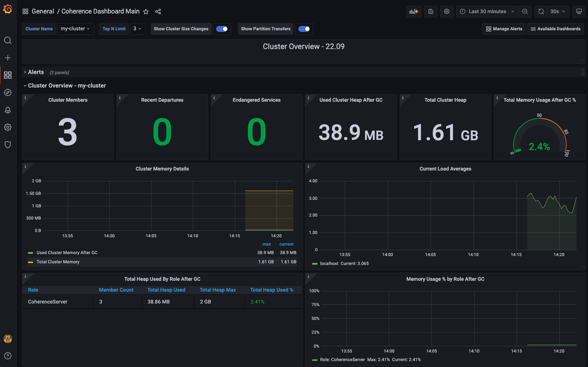

# Monitoring with Grafana and Prometheus using Docker - Starting Coherence using CLI

## What You Will Build

This example shows how to set up Grafana and Prometheus to monitor a Coherence cluster 
started with the [Coherence CLI](https://github.com/oracle/coherence-cli).

The example starts up Grafana 8.5.13 and Prometheus v2.36.2 images using Docker and then startup a cluster using 
`cohctl` with Coherence metrics enabled.

> *Note*: If you wish to monitor your own clusters. See the [Running the Example](#run) section. 

## What You Need

1. JDK 17+
2. Docker and docker-compose
3. Maven 3.8.x
4. The Coherence CLI installed and on the PATH - See [here](https://github.com/oracle/coherence-cli?tab=readme-ov-file#install-the-cli) for installation instructions
5. Clone of this repository using `git clone https://github.com/tmiddlet2666/coherence-playground.git`
           
> Note: Make sure java and mvn are in your PATH.

Open a terminal and change to the directory `monitoring`.

## Setup

You will need to download the latest Grafana dashboards that are available in the Coherence Operator.

> Note: This is only required the first time you run this example.

### Linux/ OSX

1. Ensure you are in the `monitoring/grafana` directory 
2. Run the following to download the dashboards.

    ```bash
    $ ./download-dashboards.sh
    ```

### Windows
 
1. Clone the Coherence Operator repository - https://github.com/oracle/coherence-operator.git

2. Copy all the `*.json` files from `coherence-operator/dashboards/grafana` to the directory `monitoring/grafana/dashboards` directory in your cloned `coherence-playground` directory.

## <a name="run"></a> Running the Example

> Note: If you wish to monitor your own clusters, you can enable metrics on your cache servers starting on port 9612. See the [Coherence Metrics Documentation](https://docs.oracle.com/en/middleware/standalone/coherence/14.1.1.2206/manage/using-coherence-metrics.html#GUID-6C949515-A9CB-419A-9855-FA63D672787A). 
     
1. Create and start a Coherence Cluster with metrics enabled using the following:

   ```bash
   $ cohctl create cluster my-cluster -t 9612 -v 24.03

   Cluster name:         my-cluster
   Cluster version:      24.03
   Cluster port:         7574
   Management port:      30000
   Replica count:        3
   Initial memory:       512m
   Persistence mode:     on-demand
   Group ID:             com.oracle.coherence.ce
   Additional artifacts: 
   Startup Profile:      
   Dependency Tool:      mvn
   Are you sure you want to create the cluster with the above details? (y/n) y

   Checking 3 Maven dependencies...
    - com.oracle.coherence.ce:coherence:24.03
    - com.oracle.coherence.ce:coherence-json:24.03
    - org.jline:jline:3.25.0
   Starting 3 cluster members for cluster my-cluster
   Starting cluster member storage-0...
   Starting cluster member storage-1...
   Starting cluster member storage-2...
   Cluster added and started
   Current context is now my-cluster
   ```    
   
   > Note: The `-t 9612` is used as the starting port for the metrics port and will be incremented for each server.
 
2. Startup Grafana and Prometheus

    Ensure you are in the `monitoring` directory, have Docker running and then issue the following:

    ```bash
    $ docker-compose up -d  
   
   [+] Running 2/2
   ⠿ Container grafana-prometheus-1  Running                                                                                                                                                                               0.0s
   ⠿ Container grafana-grafana-1     Started  
   
   $ docker ps
   
   CONTAINER ID   IMAGE                     COMMAND                  CREATED         STATUS          PORTS                                       NAMES
   4bc1250ec605   prom/prometheus:v2.36.2   "/bin/prometheus --c…"   2 minutes ago   Up 2 minutes    0.0.0.0:9090->9090/tcp, :::9090->9090/tcp   grafana-prometheus-1
   844114ca12a8   grafana/grafana:8.5.13    "/run.sh"                2 minutes ago   Up 22 seconds   0.0.0.0:3000->3000/tcp, :::3000->3000/tcp   grafana-grafana-
   ```
   
3. Check the status of Prometheus targets

   Open http://localhost:9090/targets and check that at least 3 of the targets are UP. 

   It may take a minute for them to be discovered.

4. Check Grafana
   
   Open the main Grafana dashboard at http://127.0.0.1:3000/d/coh-main/coherence-dashboard-main.
           
   The default username and password is: `admin`. You can change this or just press `Skip` on the first login.

   You should now see the main dashboard similar to the following:

   
   
5. Add some data using the console

   ```bash
   $ cohctl start console
   ``` 
   
   At the `Map (?):` prompt type `cache test` and press return.

   Next, type the following to add 10,000 objects of size 100, starting at 0 in batches of 1000.

   ```bash
   bulkput 10000 100 0 1000 
   ```
       
6. In Grafana, open the `Caches Summary Dashboard` by clicking on the `Available Dashboards` link on the top right.
 
7. Scale your cluster to 6 nodes using `cohctl scale cluster -r 6` and observe the Grafana dashboards updating.

## Shutting everything down

1. Stop all Docker processes using `docker-compose down`
2. Stop the Coherence cluster using `cohctl stop cluster my-cluster -y`
